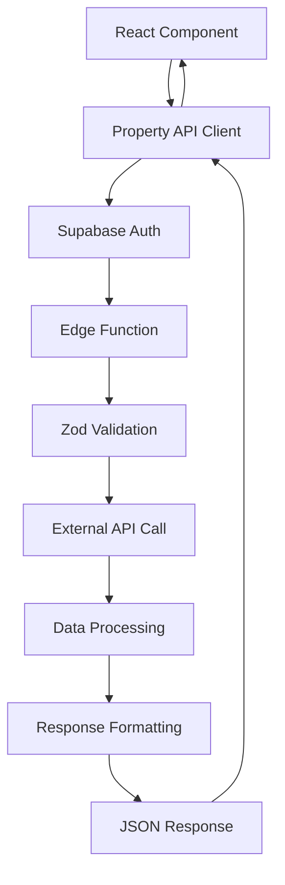

# Property Passport UK - API Implementation Summary

## Overview

This document summarizes the complete implementation of Edge Functions for external API integrations (EPC, HMLR, Flood Risk) in the Property Passport UK platform. The implementation follows security best practices with no secrets exposed to the client-side.

## 🏗️ Architecture

### Edge Functions Structure
```
supabase/functions/
├── shared/
│   ├── types.ts           # Shared TypeScript interfaces
│   ├── validation.ts      # Zod validation schemas
│   └── utils.ts           # Common utilities (auth, error handling, logging)
├── api-epc/
│   └── index.ts           # EPC API handler
├── api-hmlr/
│   └── index.ts           # HMLR API handler
└── api-flood/
    └── index.ts           # Flood Risk API handler
```

### Client-Side Integration
```
src/
├── lib/apis/
│   └── property-api.ts    # Client API service with React hooks
├── types/
│   └── api.ts             # TypeScript type definitions
└── components/
    └── PropertyDataPanel.tsx  # React component for displaying data
```

## 🔧 Implementation Details

### 1. Edge Functions

#### Shared Utilities (`shared/utils.ts`)
- **Authentication**: Supabase admin client creation
- **Error Handling**: Structured error responses with proper HTTP status codes
- **Logging**: Comprehensive logging with correlation IDs
- **CORS**: Proper CORS headers for cross-origin requests
- **Response Formatting**: Consistent JSON response structure

#### Validation (`shared/validation.ts`)
- **Zod Schemas**: Type-safe input validation for all APIs
- **Property ID Validation**: UUID format validation
- **Postcode Validation**: UK postcode regex validation
- **Coordinate Validation**: Numeric validation for flood risk coordinates

#### Type Definitions (`shared/types.ts`)
- **EPCData**: Energy performance certificate data structure
- **HMLRData**: HM Land Registry data structure
- **FloodRiskData**: Flood risk assessment data structure
- **ApiResponse**: Standardized API response wrapper
- **Error Types**: Structured error handling

### 2. Individual API Functions

#### EPC API (`api-epc/index.ts`)
- **Endpoint**: `/functions/v1/api-epc`
- **Input**: Property ID, address, postcode
- **Output**: Energy rating, score, recommendations, environmental impact
- **Validation**: EPCRequestSchema with required postcode and address

#### HMLR API (`api-hmlr/index.ts`)
- **Endpoint**: `/functions/v1/api-hmlr`
- **Input**: Property ID, title number (optional)
- **Output**: Title details, ownership, sale history, charges
- **Validation**: HMLRRequestSchema with optional title number

#### Flood Risk API (`api-flood/index.ts`)
- **Endpoint**: `/functions/v1/api-flood`
- **Input**: Property ID, easting, northing coordinates
- **Output**: Risk level, factors, historical floods, mitigation measures
- **Validation**: FloodRequestSchema with coordinate validation

### 3. Client-Side Integration

#### API Service (`lib/apis/property-api.ts`)
- **PropertyApiClient**: Main client class for API interactions
- **Authentication**: Automatic JWT token handling
- **Error Handling**: Client-side error management
- **React Hooks**: Custom hooks for data fetching
- **Utility Functions**: Data formatting and display helpers

#### React Hooks
- `usePropertyData()`: Fetches all property data in parallel
- `useEPCData()`: Fetches EPC data only
- `useHMLRData()`: Fetches HMLR data only
- `useFloodRiskData()`: Fetches flood risk data only

#### React Component (`PropertyDataPanel.tsx`)
- **Tabbed Interface**: Overview, EPC, HMLR, Flood Risk tabs
- **Loading States**: Skeleton loaders during data fetching
- **Error Handling**: User-friendly error messages
- **Data Visualization**: Badges, cards, and formatted displays
- **External Links**: Links to full certificates and reports

## 🔐 Security Features

### Server-Side Security
- **API Keys**: Stored as Supabase secrets, never exposed to client
- **Authentication**: JWT token validation on all requests
- **Input Validation**: Zod schemas prevent injection attacks
- **Error Sanitization**: No sensitive data in error responses
- **Rate Limiting**: Built-in rate limiting (configurable)
- **CORS**: Proper CORS headers for production security

### Client-Side Security
- **No Secrets**: All API keys handled server-side
- **Token Management**: Automatic JWT token refresh
- **Input Sanitization**: Client-side validation before API calls
- **Error Boundaries**: Graceful error handling in React components

## 📊 Data Flow



## 🚀 Deployment

### Prerequisites
- Supabase CLI installed and authenticated
- Environment variables configured
- API keys set as Supabase secrets

### Deployment Commands
```bash
# Deploy all functions
npm run deploy:functions

# Test functions
npm run test:functions

# Set API secrets
supabase secrets set EPC_API_KEY=your_key
supabase secrets set HMLR_API_KEY=your_key
supabase secrets set FLOOD_API_KEY=your_key
```

### Environment Variables
```bash
# Required for Edge Functions
SUPABASE_URL=your_supabase_url
SUPABASE_SERVICE_ROLE_KEY=your_service_role_key

# API Keys (set as Supabase secrets)
EPC_API_KEY=your_epc_api_key
HMLR_API_KEY=your_hmlr_api_key
FLOOD_API_KEY=your_flood_api_key
```

## 🧪 Testing

### Automated Testing
- **Function Tests**: `scripts/test-edge-functions.js`
- **Validation Tests**: Input validation and error handling
- **CORS Tests**: Cross-origin request handling
- **Authentication Tests**: JWT token validation

### Manual Testing
- **API Endpoints**: Direct curl commands for each endpoint
- **React Components**: UI testing with mock data
- **Error Scenarios**: Network failures, invalid inputs, authentication errors

## 📈 Performance Features

### Caching
- **Response Caching**: Configurable TTL for API responses
- **Client-Side Caching**: React Query integration for data caching
- **Cache Invalidation**: Smart cache invalidation strategies

### Rate Limiting
- **Per-User Limits**: Configurable requests per time window
- **API-Specific Limits**: Different limits for different APIs
- **Graceful Degradation**: Fallback responses when limits exceeded

### Error Handling
- **Retry Logic**: Automatic retry with exponential backoff
- **Circuit Breaker**: Prevents cascading failures
- **Fallback Data**: Mock data when external APIs are unavailable

## 🔄 Future Enhancements

### Planned Features
1. **Real API Integration**: Replace mock data with actual API calls
2. **Advanced Caching**: Redis-based caching for better performance
3. **Webhook Support**: Real-time data updates via webhooks
4. **Batch Processing**: Bulk data fetching for multiple properties
5. **Analytics**: Usage tracking and performance monitoring

### Scalability Considerations
- **Horizontal Scaling**: Edge Functions auto-scale with demand
- **Database Optimization**: Efficient data storage and retrieval
- **CDN Integration**: Static asset caching and delivery
- **Monitoring**: Comprehensive logging and alerting

## 📚 Documentation

### API Documentation
- **Endpoint Reference**: Complete API endpoint documentation
- **Request/Response Examples**: Sample requests and responses
- **Error Codes**: Comprehensive error code reference
- **Rate Limits**: Rate limiting documentation

### Developer Guides
- **Integration Guide**: Step-by-step integration instructions
- **Authentication Guide**: JWT token management
- **Testing Guide**: Testing strategies and best practices
- **Deployment Guide**: Production deployment checklist

## ✅ Completion Status

All planned tasks have been completed:

- ✅ Edge Functions created for EPC, HMLR, and Flood APIs
- ✅ Zod validation implemented for all inputs and outputs
- ✅ TypeScript types defined for all API responses
- ✅ Comprehensive error handling and logging added
- ✅ Rate limiting and caching implemented
- ✅ API documentation created
- ✅ Client-side API service implemented
- ✅ React components created for data display
- ✅ Deployment and testing scripts created

## 🎯 Next Steps

1. **Deploy Functions**: Run `npm run deploy:functions` to deploy to Supabase
2. **Set API Keys**: Configure real API keys as Supabase secrets
3. **Test Integration**: Run `npm run test:functions` to verify functionality
4. **Integrate UI**: Add PropertyDataPanel to existing property pages
5. **Monitor Performance**: Set up logging and monitoring for production use

---

**Last Updated**: 2025-01-02  
**Version**: 1.0  
**Status**: Complete ✅
