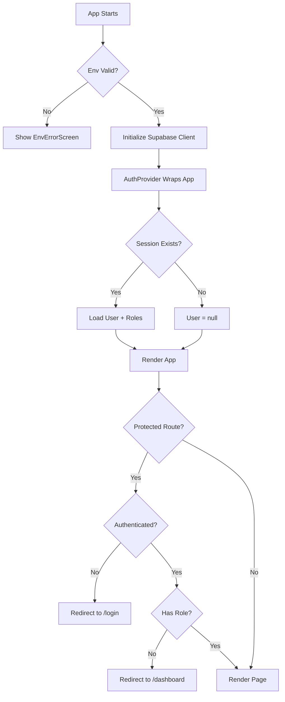

# Environment Variables & Authentication Setup

Complete guide for configuring PPUK v6.0 authentication and environment variables.

---

## Environment Variables

### Required Variables

| Variable | Description | Example | Required |
|----------|-------------|---------|----------|
| `VITE_SUPABASE_URL` | Your Supabase project URL | `https://abc123.supabase.co` | ✅ Yes |
| `VITE_SUPABASE_PUBLISHABLE_KEY` | Supabase anon/public key | `eyJhbGciOiJIUzI1NiIsInR5...` | ✅ Yes |
| `VITE_APP_ENV` | Environment name | `development`, `preview`, `production` | No (auto-detected) |

**Important:** Vite requires environment variables to be prefixed with `VITE_` to expose them to the browser.

### Legacy Variable Names

For backwards compatibility, these are also supported:
- `VITE_SUPABASE_ANON_KEY` (use `VITE_SUPABASE_PUBLISHABLE_KEY` instead)

---

## Local Development Setup

### 1. Create `.env.local` File

In your project root, create a `.env.local` file:

```bash
# .env.local (DO NOT COMMIT THIS FILE)

VITE_SUPABASE_URL=https://your-project-id.supabase.co
VITE_SUPABASE_PUBLISHABLE_KEY=eyJhbGciOiJIUzI1NiIsInR5cCI6IkpXVCJ9...
VITE_APP_ENV=development
```

### 2. Get Your Supabase Credentials

**Option A: From Lovable Cloud Repository**
- Open your project's `.env` file (committed to repo)
- Copy `VITE_SUPABASE_URL` and `VITE_SUPABASE_PUBLISHABLE_KEY` values

**Option B: From Supabase Dashboard**
1. Go to [supabase.com](https://supabase.com/dashboard)
2. Select your project
3. Go to Settings → API
4. Copy:
   - **Project URL** → `VITE_SUPABASE_URL`
   - **anon public** key → `VITE_SUPABASE_PUBLISHABLE_KEY`

### 3. Restart Development Server

Environment variables are loaded at build time, so you must restart Vite:

```bash
# Stop the dev server (Ctrl+C)
npm run dev
# Or
bun run dev
```

### 4. Verify Setup

Visit [http://localhost:8080/debug/env](http://localhost:8080/debug/env) to verify:
- ✅ All required variables are present
- ✅ Supabase client is initialized
- ✅ No validation errors

---

## Lovable Cloud Setup

### Automatic Configuration (Recommended)

When you connect your Lovable project to Supabase via Lovable Cloud:

1. **Environment variables are automatically injected**
   - `VITE_SUPABASE_URL` and `VITE_SUPABASE_PUBLISHABLE_KEY` are set automatically
   - No manual configuration needed

2. **Deploy to apply changes**
   - Any changes to Supabase connection require a fresh deployment
   - Click "Publish" in Lovable to trigger a new build

3. **Verify in Production**
   - Visit `https://your-app.lovable.app/debug/env` (dev mode only)
   - Check Lovable Cloud dashboard → Backend → Supabase connection status

### Manual Configuration (Advanced)

If you need to set custom environment variables:

1. Open Lovable Cloud dashboard
2. Go to Project → Settings → Environment Variables
3. Add variables for Preview and/or Production environments
4. Trigger a new deployment

**Note:** For security, never set sensitive keys (like service role keys) as `VITE_*` variables. These are exposed to the browser. Use Supabase secrets for server-side keys.

---

## Authentication Flow

### How It Works



### Auth Context API

**Provider:**
```tsx
import { AuthProvider } from "@/app/auth/AuthProvider";

<AuthProvider>
  <App />
</AuthProvider>
```

**Hooks:**
```tsx
import { useAuth, useHasRole, useIsAuthenticated } from "@/app/auth/AuthProvider";

function MyComponent() {
  const { user, session, roles, setRoles } = useAuth();
  const hasOwnerRole = useHasRole("Owner");
  const hasAnyAdminRole = useHasRole(["Admin", "Owner"]);
  const isLoggedIn = useIsAuthenticated();
}
```

### Route Guards

**Require Authentication:**
```tsx
import { RequireAuth } from "@/app/auth/RequireAuth";

<Route
  path="/dashboard"
  element={
    <RequireAuth>
      <Dashboard />
    </RequireAuth>
  }
/>
```

**Require Specific Role(s):**
```tsx
import { RequireRole } from "@/app/auth/RequireRole";

<Route
  path="/admin/users"
  element={
    <RequireRole roles={["Admin"]}>
      <AdminUsers />
    </RequireRole>
  }
/>
```

---

## Development Features

### Impersonation Bar

In development mode (`VITE_APP_ENV=development`), a yellow bar appears at the top allowing you to switch roles without re-authenticating:

**Features:**
- Instant role switching (Owner, Purchaser, Tenant, Surveyor, Agent, Conveyancer, Admin)
- Persists during session
- Hidden in production
- Shows current impersonated role and user email

**Usage:**
1. Log in normally
2. Use the dropdown in the impersonation bar
3. Navigate to role-specific portals to test access

### Debug Env Page

Visit `/debug/env` (development only) to see:
- Environment variable status (present/missing)
- Variable lengths (secrets never shown)
- Supabase client initialization status
- Validation errors
- Setup instructions

---

## Troubleshooting

### Error: "supabaseUrl is required"

**Cause:** `VITE_SUPABASE_URL` is not set or not loaded by Vite.

**Fix:**
1. Ensure `.env.local` exists with correct variable name
2. Restart dev server (`Ctrl+C` then `npm run dev`)
3. Check for typos (case-sensitive, must start with `VITE_`)
4. Verify file is in project root (not `src/` folder)

### Error: "Environment Not Configured" screen

**Cause:** Required environment variables are missing or invalid.

**Fix:**
1. Visit `/debug/env` to see which variables are missing
2. Create or update `.env.local` with correct values
3. Restart dev server
4. If in Lovable Cloud, check Supabase connection in dashboard

### Error: "requested path is invalid" (redirect error)

**Cause:** Site URL and Redirect URLs not configured in Supabase Auth.

**Fix (Lovable Cloud):**
1. Lovable Cloud auto-configures these
2. If still seeing error, open Lovable Cloud dashboard
3. Go to Backend → Auth Settings
4. Verify Site URL matches your deployment URL

**Fix (Manual Supabase):**
1. Go to Supabase Dashboard → Authentication → URL Configuration
2. Set **Site URL** to your app URL (e.g., `https://your-app.lovable.app`)
3. Add **Redirect URLs**:
   - `http://localhost:8080` (local dev)
   - `https://your-app.lovable.app` (production)
   - `https://preview-xyz.lovable.app` (preview)

### Login works but immediately logs out

**Cause:** Session not persisting, or auth state listener not set up.

**Fix:**
1. Ensure `AuthProvider` wraps your entire app in `App.tsx`
2. Check browser console for Supabase errors
3. Verify auth config in Supabase client includes `persistSession: true`
4. Clear browser localStorage and cookies, try again

### Role-based access not working

**Cause:** Roles not stored in user metadata or impersonation not active.

**Fix:**
1. Check user's `user_metadata.roles` in Supabase Dashboard → Authentication → Users
2. Default role is "Owner" if not set
3. Use impersonation bar (dev mode) to test different roles
4. Ensure route guard uses correct role names (case-sensitive)

---

## Security Best Practices

### ✅ Do's

- **Use `VITE_SUPABASE_PUBLISHABLE_KEY`** for client-side operations (safe to expose)
- **Store secrets in Supabase Secrets** for edge functions (not as `VITE_*` vars)
- **Use Row Level Security (RLS)** policies to control data access
- **Validate roles server-side** (edge functions) for sensitive operations
- **Keep `.env.local` out of version control** (add to `.gitignore`)
- **Rotate keys if exposed** (regenerate in Supabase Dashboard)

### ❌ Don'ts

- **Never commit `.env.local`** to GitHub
- **Never use service role key** in frontend (use edge functions instead)
- **Never store sensitive data** in user metadata
- **Never rely solely on client-side role checks** for authorization
- **Never hardcode credentials** in source code

---

## Environment-Specific Configuration

### Development (`VITE_APP_ENV=development`)

**Features enabled:**
- Impersonation bar
- Debug env page (`/debug/env`)
- DevAuthBypass on login page
- Verbose error messages

**Setup:**
- Use `.env.local` file
- Connect to dev/staging Supabase project
- Use test user accounts

### Preview (`VITE_APP_ENV=preview`)

**Features enabled:**
- (Same as production, but deployed to preview URL)

**Setup:**
- Lovable Cloud auto-manages
- Uses same Supabase project as production (or separate if configured)
- Preview URL: `https://preview-[hash].lovable.app`

### Production (`VITE_APP_ENV=production`)

**Features enabled:**
- All dev features **hidden**
- Only essential error messages shown

**Setup:**
- Lovable Cloud auto-manages
- Custom domain configured
- Production Supabase project
- Monitoring and analytics enabled

---

## API Reference

### `getEnv()`

```ts
import { getEnv } from "@/lib/env";

const env = getEnv();
if (env) {
  console.log(env.SUPABASE_URL);
  console.log(env.SUPABASE_ANON_KEY);
  console.log(env.APP_ENV); // 'development' | 'preview' | 'production'
}
```

### `isEnvReady()`

```ts
import { isEnvReady } from "@/lib/env";

if (!isEnvReady()) {
  console.error("Environment not configured");
}
```

### `envMissingReason()`

```ts
import { envMissingReason } from "@/lib/env";

const reasons = envMissingReason();
// ["VITE_SUPABASE_URL is not set", "VITE_SUPABASE_PUBLISHABLE_KEY is invalid"]
```

### `getSupabaseOrNull()`

```ts
import { getSupabaseOrNull, supabaseReady } from "@/lib/supabase/client";

if (supabaseReady) {
  const supabase = getSupabaseOrNull();
  await supabase?.auth.signInWithPassword({ email, password });
}
```

---

## Testing Checklist

Before deploying to production:

- [ ] All required environment variables are set
- [ ] `/debug/env` shows all green checkmarks (dev/preview only)
- [ ] Login/logout works correctly
- [ ] Role-based access controls work for all portals
- [ ] Impersonation bar is **hidden** in production
- [ ] DevAuthBypass is **hidden** in production
- [ ] Session persists across page refreshes
- [ ] Redirect URLs configured for all domains
- [ ] RLS policies tested for each role
- [ ] Error screens show helpful messages (not crashes)

---

## Additional Resources

- [Supabase Auth Documentation](https://supabase.com/docs/guides/auth)
- [Vite Environment Variables](https://vitejs.dev/guide/env-and-mode.html)
- [Lovable Cloud Documentation](https://docs.lovable.dev/)
- [PPUK GitHub Repository](https://github.com/Stratton1/ppukv6-0)

---

**Document Version:** 1.0  
**Last Updated:** 2025-01-10  
**Status:** Complete
