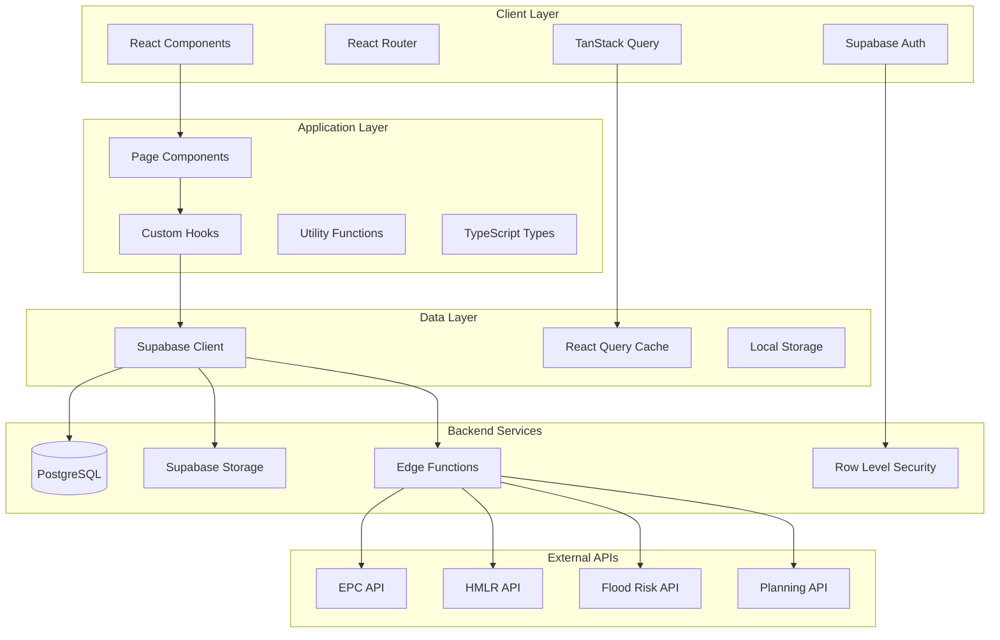

# Property Passport UK v6 - Architecture Guide

## Purpose
This document provides a comprehensive overview of the system architecture, data flow, and design patterns used in Property Passport UK v6.

## How to Use
- **Architects**: Reference for system design decisions
- **Developers**: Understand data flow and component relationships
- **Maintainers**: Guide for architectural changes and improvements

## Table of Contents
1. [System Overview](#system-overview)
2. [Architecture Diagram](#architecture-diagram)
3. [Data Flow](#data-flow)
4. [Component Architecture](#component-architecture)
5. [State Management](#state-management)
6. [Security Architecture](#security-architecture)
7. [Performance Considerations](#performance-considerations)

## System Overview

Property Passport UK v6 follows a modern, scalable architecture with clear separation of concerns:

- **Frontend**: React SPA with TypeScript
- **Backend**: Supabase (PostgreSQL + Auth + Storage)
- **External APIs**: Government and commercial data sources
- **Deployment**: Static hosting with edge functions

### Core Principles
1. **Separation of Concerns**: Clear boundaries between UI, business logic, and data
2. **Type Safety**: Full TypeScript coverage with generated types
3. **Performance**: Optimized for fast loading and smooth interactions
4. **Scalability**: Designed to handle growth in users and data
5. **Security**: Role-based access and data protection

## Architecture Diagram



## Data Flow

### 1. User Authentication Flow
```
User Login → Supabase Auth → JWT Token → Local Storage → Protected Routes
```

### 2. Property Data Flow
```
Search Query → API Client → Supabase → External APIs → Data Transformation → UI Update
```

### 3. Document Upload Flow
```
File Upload → Supabase Storage → Database Record → UI Refresh → User Feedback
```

### 4. Real-time Updates
```
Database Change → Supabase Realtime → React Query Invalidation → UI Update
```

## Component Architecture

### Layer Structure
```
Pages (Route Components)
├── Layout Components
├── Business Components
│   ├── Property Components
│   ├── Document Components
│   └── User Components
└── UI Components (Shadcn/UI)
    ├── Form Components
    ├── Display Components
    └── Interactive Components
```

### Component Patterns

#### 1. Container/Presenter Pattern
```typescript
// Container: Handles data and logic
const PropertyContainer = () => {
  const { data, loading, error } = useProperty(id);
  return <PropertyPresenter data={data} loading={loading} error={error} />;
};

// Presenter: Handles presentation
const PropertyPresenter = ({ data, loading, error }) => {
  // Pure presentation logic
};
```

#### 2. Custom Hooks Pattern
```typescript
// Data fetching hook
const useProperty = (id: string) => {
  return useQuery({
    queryKey: ['property', id],
    queryFn: () => fetchProperty(id),
  });
};

// Business logic hook
const usePropertyActions = (propertyId: string) => {
  const queryClient = useQueryClient();
  
  const claimProperty = useMutation({
    mutationFn: claimPropertyMutation,
    onSuccess: () => {
      queryClient.invalidateQueries(['property', propertyId]);
    },
  });
  
  return { claimProperty };
};
```

## State Management

### 1. Server State (TanStack Query)
- **Property data**: Cached with 5-minute TTL
- **User data**: Cached with 1-hour TTL
- **Search results**: Cached with 10-minute TTL
- **Documents**: Cached with 30-minute TTL

### 2. Client State (React State)
- **UI state**: Loading, error, form data
- **Navigation state**: Current page, filters
- **User preferences**: Theme, settings

### 3. Persistent State (Local Storage)
- **Authentication tokens**: Managed by Supabase
- **User preferences**: Theme, language
- **Search history**: Recent searches

## Security Architecture

### 1. Authentication
- **Supabase Auth**: JWT-based authentication
- **Role-based access**: Owner, Buyer, Professional roles
- **Session management**: Automatic token refresh

### 2. Authorization
- **Row Level Security (RLS)**: Database-level access control
- **Route protection**: Private routes require authentication
- **Component-level**: Role-based component rendering

### 3. Data Protection
- **Input validation**: Zod schemas for all inputs
- **Output sanitization**: XSS protection
- **CORS configuration**: Restricted origins
- **Rate limiting**: API request throttling

## Performance Considerations

### 1. Code Splitting
- **Route-based**: Each page is a separate chunk
- **Component-based**: Large components are lazy-loaded
- **Library splitting**: Vendor chunks separated

### 2. Caching Strategy
- **Browser caching**: Static assets cached for 1 year
- **API caching**: React Query with appropriate TTL
- **Image optimization**: WebP format with lazy loading

### 3. Bundle Optimization
- **Tree shaking**: Unused code elimination
- **Dynamic imports**: Lazy loading of non-critical features
- **Bundle analysis**: Regular size monitoring

### 4. Database Optimization
- **Indexes**: Optimized for common queries
- **Connection pooling**: Efficient database connections
- **Query optimization**: Minimal data transfer

## Cross-Cutting Concerns

### 1. Error Handling
- **Global error boundary**: Catches unhandled errors
- **API error handling**: Consistent error responses
- **User feedback**: Toast notifications for errors

### 2. Loading States
- **Skeleton screens**: Better perceived performance
- **Progressive loading**: Critical content first
- **Loading indicators**: Clear feedback for users

### 3. Accessibility
- **ARIA labels**: Screen reader support
- **Keyboard navigation**: Full keyboard accessibility
- **Color contrast**: WCAG AA compliance

### 4. Theming
- **CSS variables**: Dynamic theme switching
- **Dark mode**: System preference detection
- **Consistent tokens**: Design system compliance

## Next Steps

1. **Review [ROUTES_AND_PAGES.md](./ROUTES_AND_PAGES.md)** for route-specific architecture
2. **Check [COMPONENTS_HANDBOOK.md](./COMPONENTS_HANDBOOK.md)** for component patterns
3. **Read [DOMAIN_AND_DATA.md](./DOMAIN_AND_DATA.md)** for data model details
4. **See [PERFORMANCE_AND_DX.md](./PERFORMANCE_AND_DX.md)** for optimization strategies

## References
- [React Architecture Patterns](https://react.dev/learn)
- [TanStack Query Best Practices](https://tanstack.com/query/latest)
- [Supabase Architecture](https://supabase.com/docs/guides/architecture)
- [Web Performance Best Practices](https://web.dev/performance/)
